# npsExplorer

### Link: [nps-explorer.netlify.app](https://nps-explorer.netlify.app/)

Discover and explore the beauty of national parks with **npsExplorer**. Learn about park details, activities, history, and view stunning images as you create your personalized destination itinerary of parks across the country!

Working in a small team, we are challenged to develop a beautiful, mobile-first app that uses a NoSQL back end and React front end. 

*Image of Zion National Park sourced from National Park Service API*

## Tech Stack
* JavaScript 
* React
* Mongoose
* MongoDB
* Express
* Node.js
* External API

## National Park Service API
[API documentation](https://www.nps.gov/subjects/developer/api-documentation.htm)
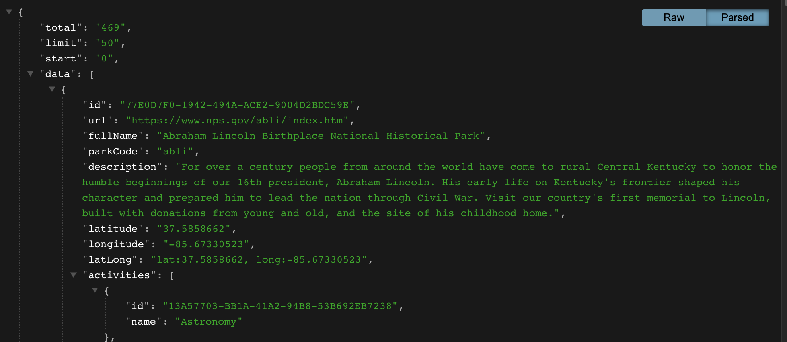

## Entity Relational Diagram
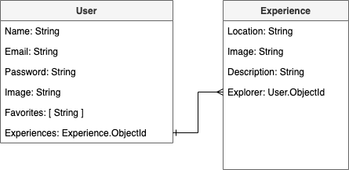

## RESTful Routing Chart
| HTTP Verb | Route                       | CRUD Action | Description                             |
|:--------- |:--------------------------- |:----------- |:--------------------------------------- |
| GET       | /                           | READ        | Home route                              |
| GET       | /search?q=                  | READ        | Search Query                            |
| GET       | /parks/:parkname            | READ        | Goes to the parks details page          |
| POST      | /parks/:parkname            | POST        | Favorites a Park                        |
| DELETE    | /parks/:parkname            | Destroy     | Removes park from favorites list        |
| GET       | /users/register             | READ        | Lands the user on the registration page |
| POST      | /users/register             | CREATE      | Creates a new user                      |
| GET       | /users/login                | READ        | Show login page                         |
| POST      | /users/login                | CREATE      | Login                                   |
| GET       | /users/profile              | READ        | Show user profile page                  |
| PUT       | /users/profile              | UPDATE      | Update profile                          |
| POST      | /experiences/:parkname | CREATE      | Post an experience                      |
| GET       | /experiences/:parkname | READ        | Display experience page                 |
| PUT       | /experiences/:parkname | UPDATE      | Update experience                       |
| DELETE    | /experience/:parkname  | DESTROY     | Delete Experience                       |
| GET       | /destinations               | READ        | Shows Favorite List                     |

## Wireframes
Signup
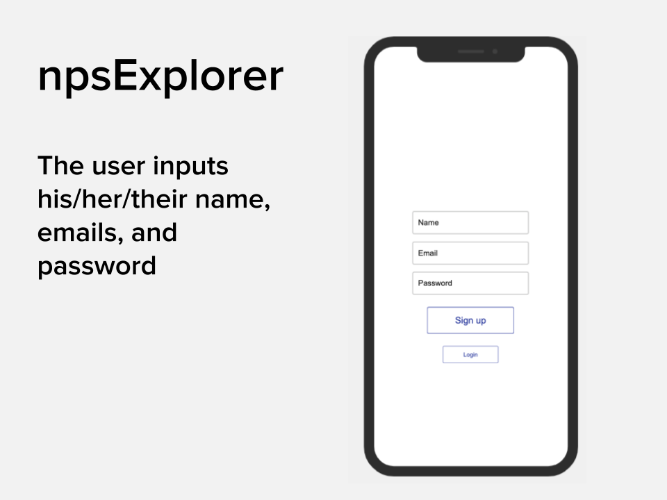

Login
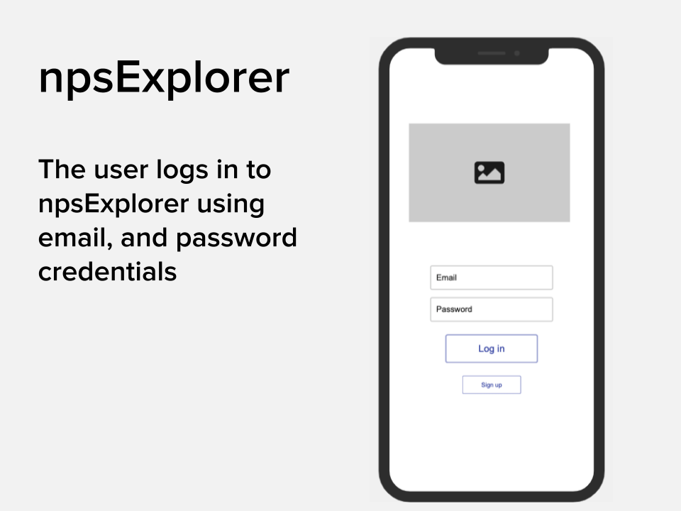

Home
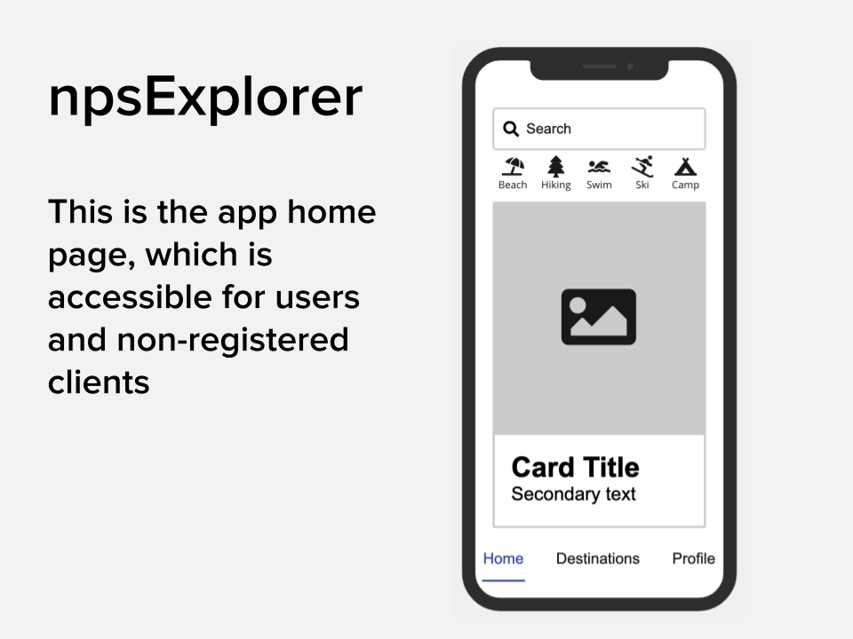

Search
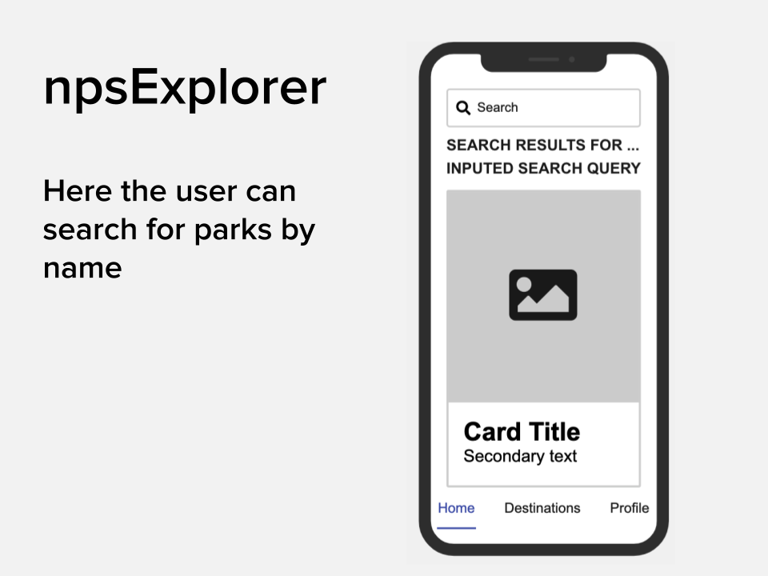

Park details
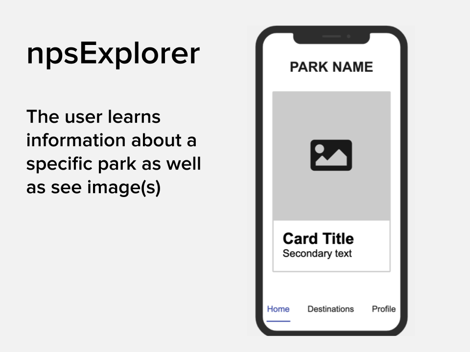

Destinations
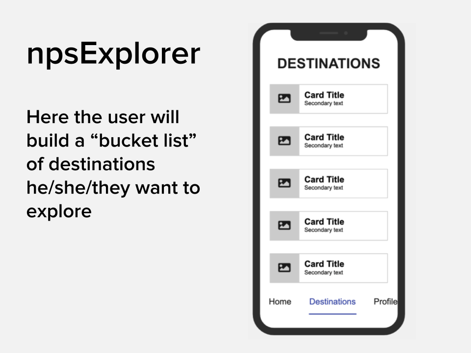

User profile
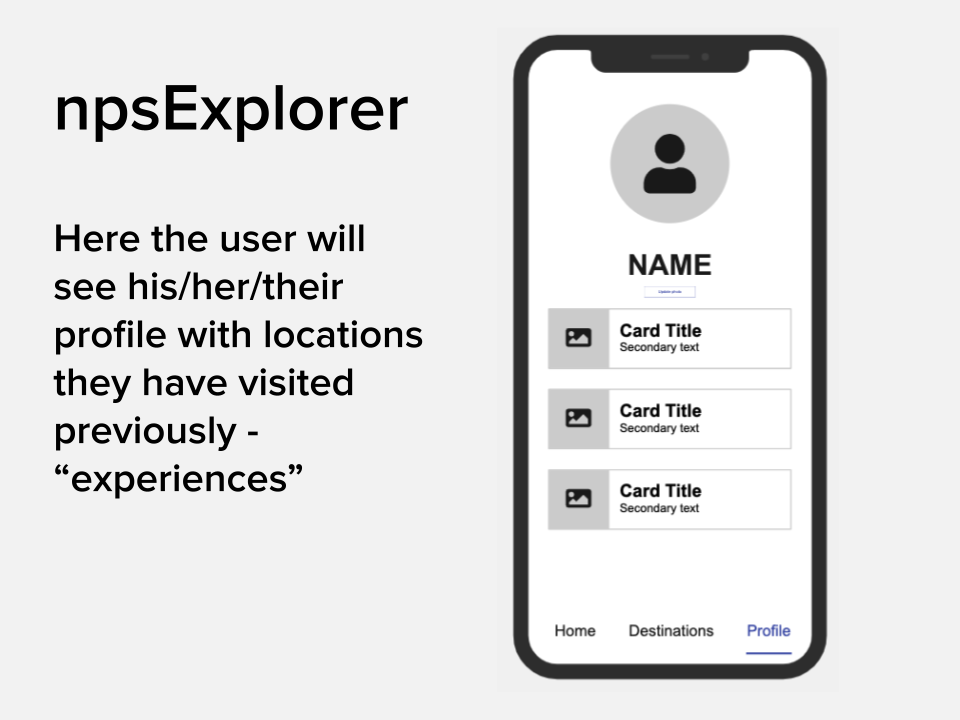

User experiences
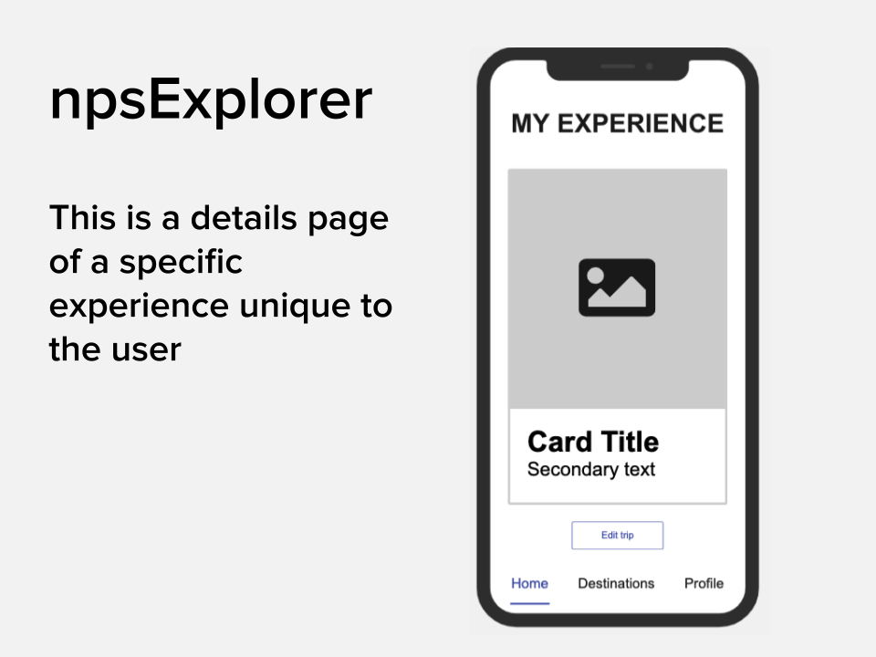

Edit experience
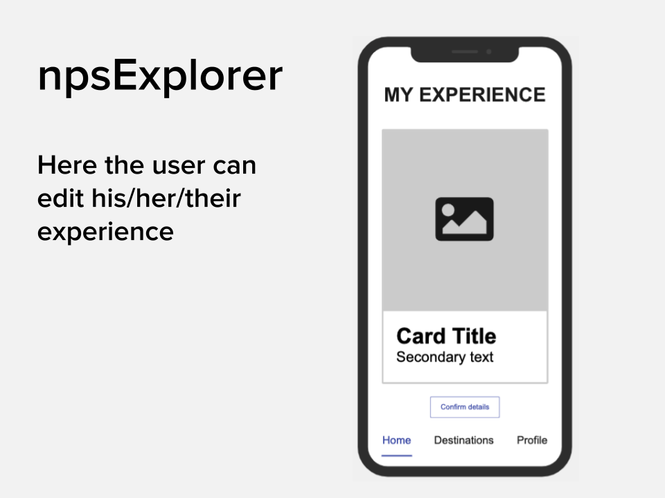

## User Stories
### MVP
* As a user I want to search national parks
* As a user I want to see I want to see basic information (hours of operation, activities, location) about a specific national park
* As a user I want to add a national park to my personal "destinations" list
* As a user I want to catalog experiences I've had at a national park
* As a user I want to see pictures of national parks
* As a user I want to see and upload personal pictures at national parks
* As a user when I click on a destination I see details page 

### Stretch
* As a user I want to see nearby national parks from a location
* As a userI want to see additional information (such as camping, amenities, alerts, historical) at a specific park
* As a userI want to see a webcam of a specific park
* As a user I want to know about trailheads in and around a national park
* As a user I want to see parks and activities that are curated for me
* As a user I want to see a carousel of images of a specific park
* As a user I want to like national parks

## Goals
### Functionality MVP
* Functional and responsive without bugs
* Send appropriate webpage status
* Populate information from a third-party API
* Be able to CRUD to the database
* Create a database that stores user information
* Render single image either uploaded by user or default image from API

### Functionality Stretch
* Generate a user-friendly response on actions
* Curated user experience that populates activities and parks based on user data
* Integrate IP location / Google Maps API to show longitude and latitude of national park
* Give a list of trails nearby
* Integrate weather api so that the user can have live updates on weather

### Design MVP
* App is attractive, comfortably spaced, information is digestable, and intuitive to use
*  Mobile-first layout
* Stylized font, color, and tiles scheme

### Design Stretch
* Tablet and desktop layout
* Incorporate 1+ front-end framework